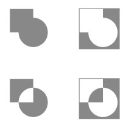

# 路径绘制

系统提供了 ``drawPath(Path path, Paint paint)`` 方法来进行路径绘制

***

## 直线路径

我们传入的画笔的样式为填充时，当多条线形成闭环之后，中间的区域会被填充

绘制直线路径设计三个点：

- 起点：Path 的 moveTo() 用于指定直线路径的起点
- 终点：Path 的 lineTo() 用于指定直线路径的终点，同时也是下一个直线路径的起点
- 闭环：Path 的 close() 方法用于形成闭环，如果连续画了几条没有形成闭环的直线，最后调用 close() 会将首尾连接起来形成闭环，因此对单一直线不起作用

```kotlin
val paint = initPaint()
val path = Path()
val (x1, y1) = getPoint(80F, 30F)
path.moveTo(x1, y1)
val (x2, y2) = getPoint(200F, 80F)
path.lineTo(x2, y2)
val (x3, y3) = getPoint(120F, 70F)
path.lineTo(x3, y3)
path.close()
canvas?.drawPath(path, paint)
```

## 弧线路径

### 弧线样式

弧线的默认样式是填充，也就是从椭圆中切出一块，只需要一条线的话需要设置画笔的样式和宽度

```kotlin
// 绘制一条弧线
paint.style = Paint.Style.STROKE
canvas.drawPath(path, paint)
// 绘制出椭圆的一部分
paint.style = Paint.Style.FILL
canvas.drawPath(path, paint)
```

### 弧线起点

弧线除了样式参数之外，还有起点参数

- 改变起点

    如果我们调用 ``moveTo()`` 方法改变了路径的起点，那么弧线就会从 ``moveTo()`` 接收到的坐标开始绘制
- 重置起点

    如果我们想要重置起点到弧线正常该开始的位置，我们可以把 ``forceMoveTo`` 设为 true

```kotlin
path.moveTo(100F, 100F)
path.arcTo(ovalRect, 0F, 90F, true)
```

### 弧线角度

arcTo() 方法中有两个参数与角度有关，``startAngle`` 和 ``sweepAngle``，这两个参数分别代表起始角和扫描角

- 起始角：设定弧线从哪里开始绘制
- 扫描角：设定弧线扫过的弧度，也就是弧线的长度

## 添加路径

### 路径添加方法

Path 提供了多个 ``addXXXX()`` 方法用于添加路径，添加的路径可以不连续

- ``addRect(RectF rect, Direction dir)`` 添加矩形
- ``addRect(float left, float top, float right, float bottom, Direction dir)``
- ``addOval(RectF oval, Direction dir)`` 添加椭圆
- ``addOval(float left, float top, float right, float bottom, Direction dir)``
- ``addCircle(float x, float y, float radius, Direction dir)`` 添加圆形
- ``addArc(RectF oval, float startAngle, float sweepAngle)`` 添加弧线
- ``addRoundRect(RecfF rect, float[] radii, Direction dir)`` 添加圆角矩形
- ``addPath(Path src, float dx, float dy)`` 添加路径
- ``addPath(Path src)``
- ``addpath(Path src, Matrix matrix)``

| 方法 | 作用 | 参数解析 |
| ---- | ---- | ---- |
| `addArc(RectF oval, float startAngle, float sweepAngle)` | 添加弧线 | `oval`：圆弧矩形区域，`startAngle`：起始角度，`sweepAngle`：弧线划过的角度 |
| ``addArc(float left, float top, float right, float bottom, float startAngle,float sweepAngle)`` | 添加弧线 | `left、top、right、bottom`：圆弧矩形区域，`startAngle`：起始角度，`sweepAngle`：弧线划过的角度 |
| ``addCircle(float x, float y, float radius, Direction dir)`` | 添加圆形 | `x`：圆心横向坐标，`y`：圆心纵向坐标，`radius`：圆形半径，`dir`：线的闭合方向（CW：顺时针，CCW：逆时针） |
| ``addOval(RectF oval, Direction dir)`` | 添加椭圆 | `oval`：椭圆的矩形范围，`dir`：线的闭合方向 |
| ``addOval(float left, float top, float right, float bottom, Direction dir)`` | 添加椭圆 | `left、top、right、bottom`：椭圆的矩形范围，`dir`：线的闭合方向 |
| ``addRect(RectF rect, Direction dir)`` | 添加矩形 | `rect`：矩形范围，`dir`：线的闭合方向 |
| ``addRect(float left, float top, float right, float bottom, Direction dir)`` | 添加矩形 | `left、top、right、bottom`：矩形范围，`dir`：线的闭合方向 |
| ``addRoundRect(RectF rect, float rx, float ry, Direction dir)`` | 添加统一圆角的圆角矩形 | `rect`：矩形范围，`rx`：椭圆圆角的横轴半径，`ry`：椭圆圆角的纵轴半径，`dir`：线的闭合范围 |
| ``addRoundRect(float left, float top, float right, float bottom, float rx, float ry,Direction dir)`` | 添加统一圆角的圆角矩形 | `left、top、right、bottom`：矩形范围，`rx`：椭圆圆角的横轴半径，`ry`：椭圆圆角的纵轴半径，`dir`：线的闭合范围 |
| ``addRoundRect(RectF rect, float[] radii, Direction dir)`` | 添加非统一圆角的圆角矩形 | `rect`：矩形范围，`radii`：矩形四个椭圆圆角的横轴半径和纵轴半径数组，`dir`：线的闭合范围 |
| ``addRoundRect(float left, float top, float right, float bottom, float[]`` | 添加非统一圆角的圆角矩形 | `left、top、right、bottom`：矩形范围，`radii`：半径数组，`dir`：线的闭合范围 |
| ``addPath(Path src)`` | 添加路径 | `src`：要添加的 path |
| ``addPath(Path src, float dx, float dy)`` | 添加一组平移后的路径 | `src`：要添加的 path，`dx`：平移的横坐标，`dy`：平移的纵坐标 |
| ``addPath(Path src, Matrix matrix)`` | 添加一组经过矩阵变换后的路径 | `src`：要添加的 path，`matrix`：3 x 3 的矩阵 |

```kotlin
val paint = getPaint()
val linePath = Path()
linePath.moveTo(80F, 60F)
linePath.lineTo(110F, 90F)
val rect = RectF(100F, 100F, 200F, 200F)
linePath.addArc(rect, 0F, 90F)
canvas.drawPath(linePath, paint)
```

### 路径绘制方向

一些添加路径的方法中有一个 Direction 参数，这个参数的作用是指定路径的绘制方向，方向有：

- 顺时针：CW，Clockwise
- 逆时针：CCW，Counter-Clockwise

### 填充路径

路径的填充模式与画笔的填充模式不同，路径的填充模式是指填充路径的哪一部分

在 Path 内部有一个 FillType 枚举类，其中定义了四种填充模式

- WINDING：填充路径内部
- EVEN_ODD：填充路径相交区域
- INVERSE_WINDING：填充路径外部
- INVERSE_EVEN_ODD：填充路径外部和相交区域

<div style="text-align: center;">
    
</div>

### 重置路径

系统提供了两种重置路径的方法，使得我们可以重复利用 Path 对象

- reset()

    类似于新建一个路径对象，除了填充类型 FillType 以外，Path 的所有数据都会被回收并重新分配
- rewind()

    会清除 FillType 和所有的路径，保留内部数据结构，以便更快地重用

    只有绘制相同路径时，这些数据结构才是可复用的

## 雷达路径

### 计算圆心

当控件大小发生变化时，onSizeChanged() 会被回调并得到最新的空间大小

网状路径的大小站当前控件的 90%，所以半径为：`min(width, height) / 2 * 0.9`

```kotlin
private var radiud: Float = 0F
private var centerX: Float = 0F
private var centerY: Float = 0F

override fun onSizeChanged(w: Int, h: Int, oldw: Int, oldh: Int) {
    radius = minOf(w, h) / 2 * 0.9F
    centerX = w / 2F
    centerY = w / 2F
    postInvalidate()
}
```