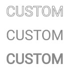
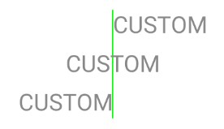
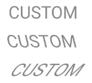
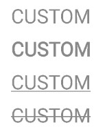
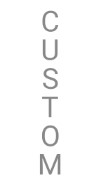
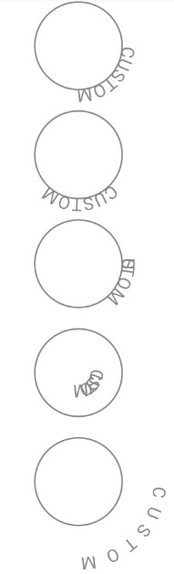

# 文字绘制

## 画笔文字参数

### 文字参数

Paint 中对文字绘制效果有影响的方法有：

| 方法 | 效果 |
| ---- | ---- |
| public void setStrokeWidth(float width) | 设置画笔宽度 |
| public void setAntiAlias(boolean aa) | 设置抗锯齿 |
| public void setStyle(Style style) | 设置填充样式，文字也可以有描边 |
| public void setTextAlign(Align align) | 设置对齐方式 |
| public void setTextSize(float textSize) | 设置字体大小 |
| public void setFakeBoldText(boolean fakeBoldText) | 设置粗体文字 |
| public void setUnderlineText(boolean unerlineText) | 设置文字下划线 |
| public void setTextSkewX(float skewX) | 设置文字倾斜水平，默认倾斜水平为 0.25 |
| public void setStrikeThruText(boolean strikeThruText) | 设置文字删除线 |

### 文字样式

我们可以通过改变画笔的样式来改变文字样式：

- STROKE：描边
- FILL：填充（默认）
- FILL_AND_STROKE：描边且填充

<div style="text-align: center;">
    
</div>

### 文字对齐方式

文字的对齐方式有：

- LEFT：左对齐，默认
- CENTER：居中对齐
- RIGHT：右对齐

<div style="text-align: center;">
    
</div>

### 文字倾斜角度

我们可以通过 `setTextSkewX` 来设置倾斜角度，当倾斜角度为正时，文字向左倾斜，当倾斜角度为负时，文字向右倾斜

<div style="text-align: center;">
    
</div>

### 文字拉伸

我们可以通过 `setTextScaleX` 来设置文字水平方向的拉伸程度，数值大于一时，文本向宽拉伸，数值小于一时，文本向窄拉伸

<div style="text-align: center;">
    
</div>

### 其他设置

```kotlin
// 正常字体
drawText(canvas = can, top = 50F)
// 加粗字体
paint.isFakeBoldText = true
drawText(canvas = can, top = 100F)
paint.isFakeBoldText = false
// 下划线
paint.isUnderlineText = true
drawText(canvas = can, top = 150F)
paint.isUnderlineText = false
// 删除线
paint.isStrikeThruText = true
drawText(canvas = can, top = 200F)
paint.isStrikeThruText = false
```

<div style="text-align: center;">
    
</div>

## 画布绘制文字

### 逐字绘制文字

我们可以使用 `drawPosText()` 来逐字绘制文字，我们需要传入一个 Float 数组来指定每个字符的位置，传入的文本有多长，我们就需要指定几个文本的位置，否则会导致界面崩溃

<div style="text-align: center;">
    
</div>

### 沿路径绘制文字

我们可以使用 `drawTextOnPath()` 来沿着路径绘制文字，可指定水平或垂直方向的偏移参数

```kotlin
private fun drawText(canvas: Canvas, top: Float, horizontalOffset: Float, verticalOffset: Float) {
    // horizontalOffset: 水平方向偏移
    // verticalOffset: 垂直方向偏移
    val path = Path()
    val y = dp2px(this, top)
    val radius = dp2px(this, 50F)
    path.rewind()
    path.addCircle(centerX, y, radius, Path.Direction.CW)
    canvas.drawPath(path, circlePaint)
    canvas.drawTextOnPath("CUSTOM", path, horizontalOffset, verticalOffset, textPaint)
}

canvas?.let { can ->
    // 正常文字
    drawText(can, 100F, 0F, 0F)
    // 正向水平偏移
    drawText(can, 225F, 100F, 0F)
    // 反向水平偏移
    drawText(can, 350F, -100F, 0F)
    // 正向垂直偏移
    drawText(can, 475F, 0F, 100F)
    // 反向垂直偏移
    drawText(can, 600F, 0F, -100f)
}
```

<div style="text-align: center;">
    
</div>

